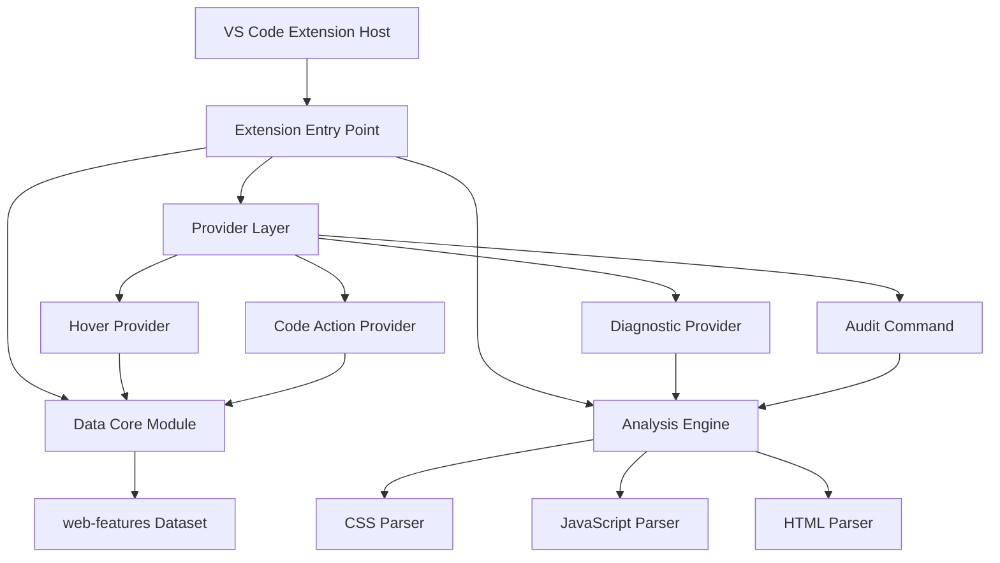

# Design Document

## Overview

The Baseline Sidekick is a VS Code extension that provides real-time analysis of web platform feature compatibility using the web-features dataset. The extension follows a modular architecture with five distinct components that work together to provide diagnostics, hover information, code actions, and project auditing capabilities.

The extension leverages VS Code's extension API to integrate seamlessly into the developer workflow, providing non-intrusive compatibility feedback and actionable suggestions for improving cross-browser support.

## Architecture

The extension follows a layered architecture pattern with clear separation of concerns:



### Data Flow

1. **Initialization**: Extension loads and caches web-features data
2. **File Analysis**: When files are opened/edited, parsers extract feature usage
3. **Compatibility Check**: Features are checked against Baseline support data
4. **User Interaction**: Providers respond to hover, code actions, and commands
5. **Feedback Loop**: Diagnostics and suggestions are presented to the user

## Components and Interfaces

### Module 1: Data Core (`src/core/baselineData.ts`)

**Purpose**: Centralized access to web-features compatibility data with performance optimization.

**Key Classes**:
```typescript
class BaselineDataManager {
  private static instance: BaselineDataManager;
  private featuresData: WebFeaturesData;
  
  public static getInstance(): BaselineDataManager;
  public getFeatureData(featureId: string): Feature | undefined;
  public isBaselineSupported(featureId: string): boolean;
  public getMdnUrl(featureData: Feature): string;
}

interface Feature {
  name: string;
  status: {
    baseline: boolean | 'high' | 'low' | false;
    baseline_low_date?: string;
    baseline_high_date?: string;
  };
  spec: string;
  mdn_url?: string;
  usage_stats?: object;
}
```

**Design Decisions**:
- Singleton pattern ensures single data load and consistent access
- Lazy loading with caching for optimal memory usage
- Type-safe interfaces for web-features data structure

### Module 2: Analysis Engine (`src/diagnostics.ts`, `src/core/parser.ts`)

**Purpose**: Multi-language parsing and feature detection with diagnostic generation.

**Key Classes**:
```typescript
class DiagnosticController {
  private diagnosticCollection: vscode.DiagnosticCollection;
  
  public updateDiagnostics(document: vscode.TextDocument): void;
  private analyzeDocument(document: vscode.TextDocument): string[];
}

class FeatureParser {
  public static parseCss(content: string): string[];
  public static parseJavaScript(content: string): string[];
  public static parseHtml(content: string): string[];
}
```

**Parser Implementations**:

1. **CSS Parser**: Uses PostCSS for reliable AST parsing
   - Extracts property names from declarations
   - Maps CSS properties to web-features IDs (e.g., `gap` → `css.properties.gap`)

2. **JavaScript Parser**: Uses Babel for comprehensive AST analysis
   - Detects MemberExpression patterns (`navigator.clipboard`)
   - Identifies CallExpression on globals (`document.querySelector`)
   - Maps API usage to web-features IDs (e.g., `clipboard` → `api.Clipboard`)

3. **HTML Parser**: Uses parse5 for standards-compliant parsing
   - Extracts element and attribute names
   - Maps to web-features HTML IDs (e.g., `dialog` → `html.elements.dialog`)

### Module 3: Hover Provider (`src/providers/hoverProvider.ts`)

**Purpose**: Rich contextual information display for compatibility issues.

**Key Classes**:
```typescript
class BaselineHoverProvider implements vscode.HoverProvider {
  public provideHover(
    document: vscode.TextDocument,
    position: vscode.Position,
    token: vscode.CancellationToken
  ): vscode.ProviderResult<vscode.Hover>;
  
  private createHoverContent(featureData: Feature): vscode.MarkdownString;
}
```

**Hover Content Structure**:
- Feature name and compatibility badge
- Specific browser support details
- Direct links to MDN and CanIUse
- Suggested alternatives when available

### Module 4: Code Action Provider (`src/providers/codeActionProvider.ts`)

**Purpose**: Automated refactoring suggestions for compatibility improvements.

**Key Classes**:
```typescript
class BaselineCodeActionProvider implements vscode.CodeActionProvider {
  public provideCodeActions(
    document: vscode.TextDocument,
    range: vscode.Range,
    context: vscode.CodeActionContext,
    token: vscode.CancellationToken
  ): vscode.ProviderResult<vscode.CodeAction[]>;
  
  private createRefactoringActions(featureId: string, range: vscode.Range): vscode.CodeAction[];
}
```

**Refactoring Strategies**:
- CSS: `float` → Flexbox, `@supports` fallbacks
- JavaScript: `XMLHttpRequest` → `fetch()`, `Array.at()` → bracket notation
- HTML: Deprecated elements → modern alternatives

### Module 5: Audit Command (`src/commands/audit.ts`)

**Purpose**: Project-wide compatibility analysis and reporting.

**Key Classes**:
```typescript
class WorkspaceAuditor {
  public async auditWorkspace(): Promise<void>;
  private async scanFile(uri: vscode.Uri): Promise<CompatibilityIssue[]>;
  private generateReport(issues: CompatibilityIssue[]): string;
}

interface CompatibilityIssue {
  featureId: string;
  filePath: string;
  lineNumber: number;
  severity: 'error' | 'warning' | 'info';
}
```

## Data Models

### Core Data Structures

```typescript
// Web Features Data Model
interface WebFeaturesData {
  [featureId: string]: Feature;
}

// Diagnostic Enhancement
interface EnhancedDiagnostic extends vscode.Diagnostic {
  code: {
    value: string; // featureId
    target: vscode.Uri;
  };
}

// Parser Result
interface ParseResult {
  features: string[];
  locations: Map<string, vscode.Range[]>;
}
```

### Feature ID Mapping

The extension maintains mappings between parsed tokens and web-features IDs:

- **CSS**: `gap` → `css.properties.gap`
- **JavaScript**: `navigator.clipboard` → `api.Clipboard`
- **HTML**: `<dialog>` → `html.elements.dialog`

## Error Handling

### Graceful Degradation Strategy

1. **Parser Failures**: Continue with other parsers, log errors
2. **Data Loading Issues**: Show user notification, disable features
3. **Network Timeouts**: Use cached data, retry mechanism
4. **Invalid Feature IDs**: Skip unknown features, continue processing

### Error Recovery Mechanisms

```typescript
class ErrorHandler {
  public static handleParserError(error: Error, fileType: string): void;
  public static handleDataLoadError(error: Error): void;
  public static logError(error: Error, context: string): void;
}
```

## Testing Strategy

### Unit Testing Approach

1. **Parser Testing**: Comprehensive test cases for each language parser
   - Valid syntax parsing
   - Edge cases and malformed input
   - Performance benchmarks

2. **Data Core Testing**: Mock web-features data for consistent testing
   - Feature lookup accuracy
   - Caching behavior validation
   - Error handling verification

3. **Provider Testing**: VS Code API mocking for provider functionality
   - Hover content generation
   - Code action creation
   - Diagnostic accuracy

### Integration Testing

1. **End-to-End Workflows**: Complete user scenarios
   - File analysis → diagnostic → hover → code action
   - Workspace audit → report generation

2. **Performance Testing**: Large file and project handling
   - Memory usage monitoring
   - Response time validation
   - Concurrent operation handling

### Test Data Management

- Curated test files for each supported language
- Mock web-features dataset for predictable testing
- Automated test file generation for edge cases

## Performance Considerations

### Optimization Strategies

1. **Data Loading**: Single load with intelligent caching
2. **Parsing**: Incremental analysis on file changes only
3. **Memory Management**: Weak references for large datasets
4. **Debouncing**: Limit analysis frequency during rapid typing

### Scalability Measures

- Asynchronous processing for large files
- Worker threads for CPU-intensive parsing
- Progressive loading for workspace audits
- Configurable analysis depth and scope