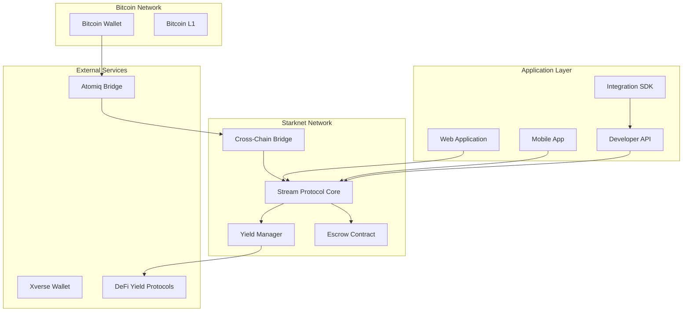
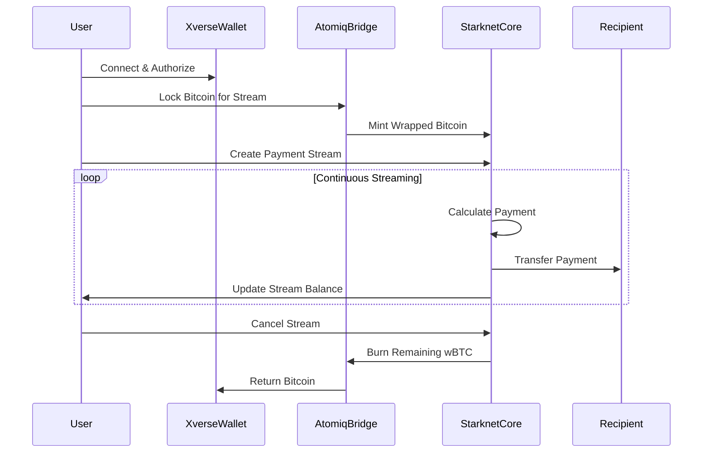

# BitFlow Design Document

## Overview

BitFlow is a cross-chain Bitcoin payment streaming protocol built on Starknet that enables continuous, real-time payments using Bitcoin. The system leverages Starknet's ultra-low fees and high throughput while maintaining Bitcoin's security properties through established cross-chain bridge protocols.

The architecture consists of three main layers:
1. **Cross-Chain Bridge Layer** - Handles Bitcoin ↔ Starknet asset conversion
2. **Streaming Protocol Layer** - Manages payment streams, escrow, and yield generation
3. **Application Layer** - Provides user interfaces, APIs, and integrations

## Architecture

### High-Level System Architecture



### Cross-Chain Flow Architecture



## Components and Interfaces

### 1. Cross-Chain Bridge Integration

**AtomiqBridgeAdapter**
- Handles Bitcoin locking and unlocking
- Manages wrapped Bitcoin (wBTC) minting/burning on Starknet
- Provides transaction status tracking
- Implements security validations

```cairo
#[starknet::interface]
trait IAtomiqBridgeAdapter<TContractState> {
    fn lock_bitcoin(ref self: TContractState, amount: u256, recipient: ContractAddress) -> u256;
    fn unlock_bitcoin(ref self: TContractState, stream_id: u256, amount: u256) -> bool;
    fn get_bridge_status(self: @TContractState, tx_hash: felt252) -> BridgeStatus;
}
```

### 2. Stream Protocol Core

**StreamManager**
- Creates and manages payment streams
- Handles stream lifecycle (create, pause, resume, cancel)
- Calculates real-time payment distributions
- Manages stream metadata and permissions

```cairo
#[starknet::interface]
trait IStreamManager<TContractState> {
    fn create_stream(
        ref self: TContractState,
        recipient: ContractAddress,
        amount: u256,
        rate: u256,
        duration: u64
    ) -> u256;
    
    fn cancel_stream(ref self: TContractState, stream_id: u256) -> bool;
    fn withdraw_from_stream(ref self: TContractState, stream_id: u256) -> u256;
    fn get_stream_balance(self: @TContractState, stream_id: u256) -> u256;
}
```

**EscrowManager**
- Securely holds locked Bitcoin/wBTC
- Implements multi-signature security
- Handles emergency pause mechanisms
- Manages fund recovery procedures

```cairo
#[starknet::interface]
trait IEscrowManager<TContractState> {
    fn deposit_funds(ref self: TContractState, stream_id: u256, amount: u256) -> bool;
    fn release_funds(ref self: TContractState, stream_id: u256, amount: u256, recipient: ContractAddress) -> bool;
    fn emergency_pause(ref self: TContractState) -> bool;
    fn get_escrow_balance(self: @TContractState, stream_id: u256) -> u256;
}
```

### 3. Yield Generation System

**YieldManager**
- Integrates with Starknet DeFi protocols (Vesu, Troves/Endurfi)
- Automatically stakes idle Bitcoin/wBTC
- Distributes yield back to stream balances
- Manages risk parameters and protocol selection

```cairo
#[starknet::interface]
trait IYieldManager<TContractState> {
    fn stake_idle_funds(ref self: TContractState, amount: u256) -> bool;
    fn unstake_funds(ref self: TContractState, amount: u256) -> bool;
    fn distribute_yield(ref self: TContractState, stream_id: u256) -> u256;
    fn get_yield_rate(self: @TContractState) -> u256;
}
```

### 4. Subscription Management

**SubscriptionManager**
- Handles recurring payment setups
- Manages subscription lifecycle
- Implements flexible pricing models
- Provides subscription analytics

```cairo
#[starknet::interface]
trait ISubscriptionManager<TContractState> {
    fn create_subscription_plan(
        ref self: TContractState,
        price: u256,
        interval: u64,
        max_subscribers: u32
    ) -> u256;
    
    fn subscribe(ref self: TContractState, plan_id: u256, duration: u64) -> u256;
    fn cancel_subscription(ref self: TContractState, subscription_id: u256) -> bool;
    fn get_subscription_status(self: @TContractState, subscription_id: u256) -> SubscriptionStatus;
}
```

## Data Models

### Core Data Structures

```cairo
#[derive(Drop, Serde, starknet::Store)]
struct PaymentStream {
    id: u256,
    sender: ContractAddress,
    recipient: ContractAddress,
    total_amount: u256,
    rate_per_second: u256,
    start_time: u64,
    end_time: u64,
    withdrawn_amount: u256,
    is_active: bool,
    yield_enabled: bool,
}

#[derive(Drop, Serde, starknet::Store)]
struct Subscription {
    id: u256,
    plan_id: u256,
    subscriber: ContractAddress,
    provider: ContractAddress,
    stream_id: u256,
    start_time: u64,
    end_time: u64,
    auto_renew: bool,
    status: SubscriptionStatus,
}

#[derive(Drop, Serde, starknet::Store)]
struct YieldPosition {
    stream_id: u256,
    protocol: ContractAddress,
    staked_amount: u256,
    earned_yield: u256,
    last_update: u64,
}
```

### State Management

The system maintains several key mappings:
- `streams: LegacyMap<u256, PaymentStream>` - All payment streams
- `user_streams: LegacyMap<ContractAddress, Array<u256>>` - User's stream IDs
- `subscriptions: LegacyMap<u256, Subscription>` - All subscriptions
- `yield_positions: LegacyMap<u256, YieldPosition>` - Yield tracking per stream

## Error Handling

### Error Categories

1. **Bridge Errors**
   - Bitcoin transaction failures
   - Cross-chain communication timeouts
   - Insufficient Bitcoin balance
   - Bridge protocol downtime

2. **Stream Errors**
   - Insufficient stream balance
   - Invalid stream parameters
   - Unauthorized access attempts
   - Stream already completed/cancelled

3. **Yield Errors**
   - DeFi protocol failures
   - Slippage beyond tolerance
   - Yield protocol downtime
   - Insufficient liquidity

### Error Recovery Mechanisms

```cairo
#[derive(Drop, Serde)]
enum BitFlowError {
    InsufficientBalance,
    StreamNotFound,
    UnauthorizedAccess,
    BridgeFailure,
    YieldProtocolError,
    InvalidParameters,
}

#[starknet::interface]
trait IErrorHandler<TContractState> {
    fn handle_bridge_failure(ref self: TContractState, stream_id: u256) -> bool;
    fn emergency_withdraw(ref self: TContractState, stream_id: u256) -> bool;
    fn pause_all_streams(ref self: TContractState) -> bool;
}
```

### Graceful Degradation

- **Bridge Downtime**: Queue transactions for retry when bridge recovers
- **Yield Protocol Issues**: Automatically switch to backup yield strategies
- **Network Congestion**: Batch multiple stream updates to reduce gas costs
- **Partial Failures**: Continue operating other streams while isolating failed ones

## Testing Strategy

### Unit Testing

1. **Smart Contract Tests**
   - Stream creation and management logic
   - Escrow deposit/withdrawal mechanisms
   - Yield calculation accuracy
   - Access control and permissions

2. **Integration Tests**
   - Cross-chain bridge interactions
   - DeFi protocol integrations
   - Wallet connection flows
   - API endpoint functionality

### End-to-End Testing

1. **User Journey Tests**
   - Complete stream creation flow
   - Subscription setup and management
   - Mobile app functionality
   - Developer API integration

2. **Security Tests**
   - Smart contract audits
   - Cross-chain bridge security
   - Access control validation
   - Emergency pause mechanisms

### Performance Testing

1. **Load Testing**
   - Multiple concurrent streams
   - High-frequency micro-payments
   - API rate limiting
   - Database query optimization

2. **Stress Testing**
   - Network congestion scenarios
   - Bridge failure recovery
   - Maximum stream capacity
   - Yield protocol failures

### Test Environment Setup

```cairo
// Test configuration for local development
#[cfg(test)]
mod tests {
    use super::*;
    
    #[test]
    fn test_stream_creation() {
        // Test stream creation with valid parameters
    }
    
    #[test]
    fn test_cross_chain_bridge() {
        // Test Bitcoin locking and wBTC minting
    }
    
    #[test]
    fn test_yield_generation() {
        // Test yield calculation and distribution
    }
}
```

### Continuous Integration

- Automated testing on every commit
- Smart contract deployment to testnet
- Security scanning and vulnerability assessment
- Performance benchmarking and regression testing