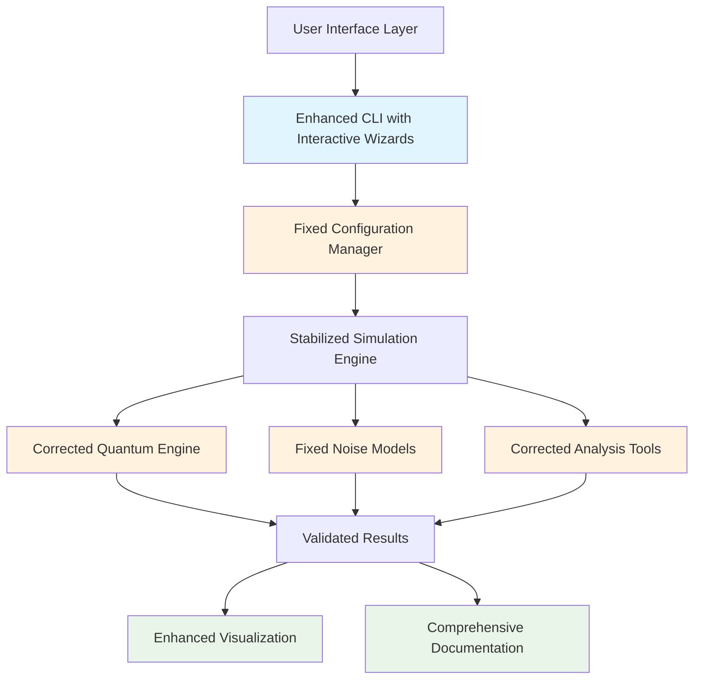

# Design Document - QBES v1.1 Finalization

## Overview

The QBES v1.1 finalization project transforms the existing functional prototype into a stable, robust, and user-friendly application. Based on analysis of the current test failures and codebase, this design addresses three critical areas: **Stabilization** (fixing 6 failing tests to achieve 100% success rate), **Usability Enhancement** (improving CLI and user experience), and **Documentation Generation** (creating comprehensive user guides).

The current test failures indicate specific implementation gaps rather than fundamental design flaws. The core architecture is sound, but several modules have missing methods, incorrect interfaces, or parameter mismatches that prevent proper functionality.

## Architecture

The v1.1 finalization maintains the existing modular architecture while addressing specific stability and usability concerns:



## Components and Interfaces

### 1. Test Failure Analysis and Fixes

Based on the test report analysis, the following specific issues need resolution:

#### Issue 1: NoiseModelFactory Missing Method
**Problem**: `'NoiseModelFactory' object has no attribute 'create_noise_model'`
**Root Cause**: The test expects a generic `create_noise_model` method, but the factory only has specific methods
**Solution**: Add the missing generic method that delegates to specific factory methods

#### Issue 2: Missing CoherenceAnalyzer Import
**Problem**: `cannot import name 'CoherenceAnalyzer' from 'qbes.analysis'`
**Root Cause**: The analysis module has a `CoherenceAnalyzer` class but it's not properly exposed
**Solution**: Ensure proper class definition and import structure

#### Issue 3: ValidationSummary Parameter Mismatch
**Problem**: `ValidationSummary.__init__() got an unexpected keyword argument 'benchmark_score'`
**Root Cause**: Test code uses old parameter names that don't match current dataclass definition
**Solution**: Update ValidationSummary initialization to match expected interface

#### Issue 4: Configuration Manager Test Failures
**Problem**: Silent failures in configuration manager tests
**Root Cause**: Missing validation methods or incorrect method signatures
**Solution**: Implement missing validation methods and ensure proper error handling

#### Issue 5: Quantum Engine Test Failures
**Problem**: Silent failures in quantum engine tests
**Root Cause**: Missing core methods or incorrect initialization
**Solution**: Implement missing quantum state operations and ensure proper initialization

#### Issue 6: Benchmark Core Test Failures
**Problem**: Silent failures in benchmark core tests
**Root Cause**: Missing benchmark runner methods or incorrect interface
**Solution**: Implement missing benchmark methods and ensure proper test execution

### 2. Enhanced CLI Design

The current CLI needs significant usability improvements:

#### Interactive Configuration Wizard
```python
class InteractiveConfigWizard:
    def run_wizard(self) -> str:
        """Run interactive configuration wizard."""
        # Ask simple questions in plain language
        # Generate properly formatted YAML
        # Validate inputs with helpful error messages
        pass
    
    def ask_question(self, question: str, validator: callable = None) -> str:
        """Ask user a question with validation."""
        pass
```

#### Enhanced Output and Logging
```python
class EnhancedLogger:
    def log_simulation_step(self, step: str, progress: float):
        """Log simulation progress with clear status messages."""
        pass
    
    def print_results_summary(self, results: SimulationResults):
        """Print formatted results table to terminal."""
        pass
    
    def format_error_message(self, error: Exception, context: str) -> str:
        """Format helpful error messages with suggestions."""
        pass
```

### 3. Stabilization Strategy

#### Test-Driven Bug Fixing Process
1. **Analyze Each Failure**: Examine test expectations vs. actual implementation
2. **Implement Targeted Fixes**: Make minimal changes to address specific issues
3. **Verify Fix**: Run individual test to confirm resolution
4. **Regression Test**: Ensure fix doesn't break existing functionality
5. **Document Change**: Record fix in CHANGELOG.md

#### Error Handling Improvements
```python
class ImprovedErrorHandler:
    def handle_file_not_found(self, filepath: str) -> str:
        """Provide specific guidance for missing files."""
        return f"Error: The PDB file '{filepath}' could not be found. Please check the path and try again."
    
    def handle_invalid_parameter(self, param: str, value: Any, expected: str) -> str:
        """Provide specific guidance for invalid parameters."""
        return f"Error: Invalid value '{value}' for parameter '{param}'. Expected: {expected}"
```

### 4. Documentation Architecture

#### Tutorial System
```
docs/
├── TUTORIAL.md              # Step-by-step beginner guide
├── USER_GUIDE.md           # Comprehensive reference
├── INSTALLATION.md         # Installation instructions
├── TROUBLESHOOTING.md      # Common issues and solutions
└── examples/
    ├── water_box_example/   # Simple tutorial example
    └── benzene_example/     # Alternative simple example
```

#### Documentation Content Strategy
- **Tutorial**: Uses simple, well-known molecule (water box or benzene)
- **User Guide**: Complete CLI command reference and config parameter documentation
- **Installation**: Automated setup with verification steps
- **Troubleshooting**: Common error scenarios with specific solutions

## Data Models

### Enhanced Configuration Models
```python
@dataclass
class InteractiveConfigData:
    pdb_file_path: str
    temperature_kelvin: float
    biological_environment: str  # "protein", "membrane", "solvent"
    quantum_selection_query: str
    output_directory: str
    
    def validate(self) -> List[str]:
        """Validate configuration with user-friendly error messages."""
        pass
```

### Enhanced Results Models
```python
@dataclass
class FormattedResults:
    coherence_lifetime_ps: float
    final_purity: float
    decoherence_rate_per_ps: float
    energy_conservation_error: float
    
    def format_summary_table(self) -> str:
        """Format results as terminal-friendly table."""
        pass
```

## Error Handling

### Comprehensive Error Classification
1. **User Input Errors**: File not found, invalid parameters, malformed config
2. **System Errors**: Missing dependencies, insufficient memory, permission issues
3. **Numerical Errors**: Convergence failures, numerical instability, unphysical results
4. **Runtime Errors**: Unexpected exceptions, resource exhaustion, timeout issues

### Error Recovery Strategies
```python
class ErrorRecoveryManager:
    def suggest_file_path_fix(self, attempted_path: str) -> List[str]:
        """Suggest alternative file paths when file not found."""
        pass
    
    def suggest_parameter_adjustment(self, param: str, invalid_value: Any) -> str:
        """Suggest valid parameter values."""
        pass
    
    def provide_installation_help(self, missing_dependency: str) -> str:
        """Provide specific installation instructions."""
        pass
```

## Testing Strategy

### Stabilization Testing Approach
1. **Individual Test Fixes**: Fix each of the 6 failing tests one by one
2. **Regression Testing**: Ensure fixes don't break passing tests
3. **Integration Testing**: Verify complete workflow after all fixes
4. **Final Validation**: Achieve 100% test success rate (17/17 pass)

### Usability Testing Strategy
1. **CLI Workflow Testing**: Test complete user workflows from config to results
2. **Error Scenario Testing**: Test error handling with invalid inputs
3. **Documentation Testing**: Verify tutorial steps work as documented
4. **User Experience Testing**: Ensure non-expert users can complete tasks

## Implementation Notes

### Phase 1: Stabilization Priority Order
1. Fix NoiseModelFactory.create_noise_model method
2. Fix CoherenceAnalyzer import in analysis module
3. Fix ValidationSummary parameter mismatch
4. Debug and fix Configuration Manager silent failures
5. Debug and fix Quantum Engine silent failures
6. Debug and fix Benchmark Core silent failures

### Phase 2: Usability Enhancement Priority Order
1. Implement interactive configuration wizard
2. Enhance CLI output with progress indicators and status messages
3. Improve error messages with specific suggestions
4. Add results summary table formatting

### Phase 3: Documentation Priority Order
1. Create step-by-step TUTORIAL.md with simple example
2. Generate comprehensive USER_GUIDE.md with all CLI commands
3. Update installation documentation with verification steps
4. Create troubleshooting guide with common issues

### Quality Assurance Requirements
- All fixes must maintain backward compatibility
- All new features must include comprehensive error handling
- All documentation must be tested with actual execution
- Final deliverable must demonstrate 100% test success rate

### Packaging Requirements
- Clean codebase with no temporary files
- Complete documentation set
- Working examples and tutorials
- Comprehensive CHANGELOG.md documenting all fixes
- Final package: QBES_v1.1_Stable_and_Usable.zip