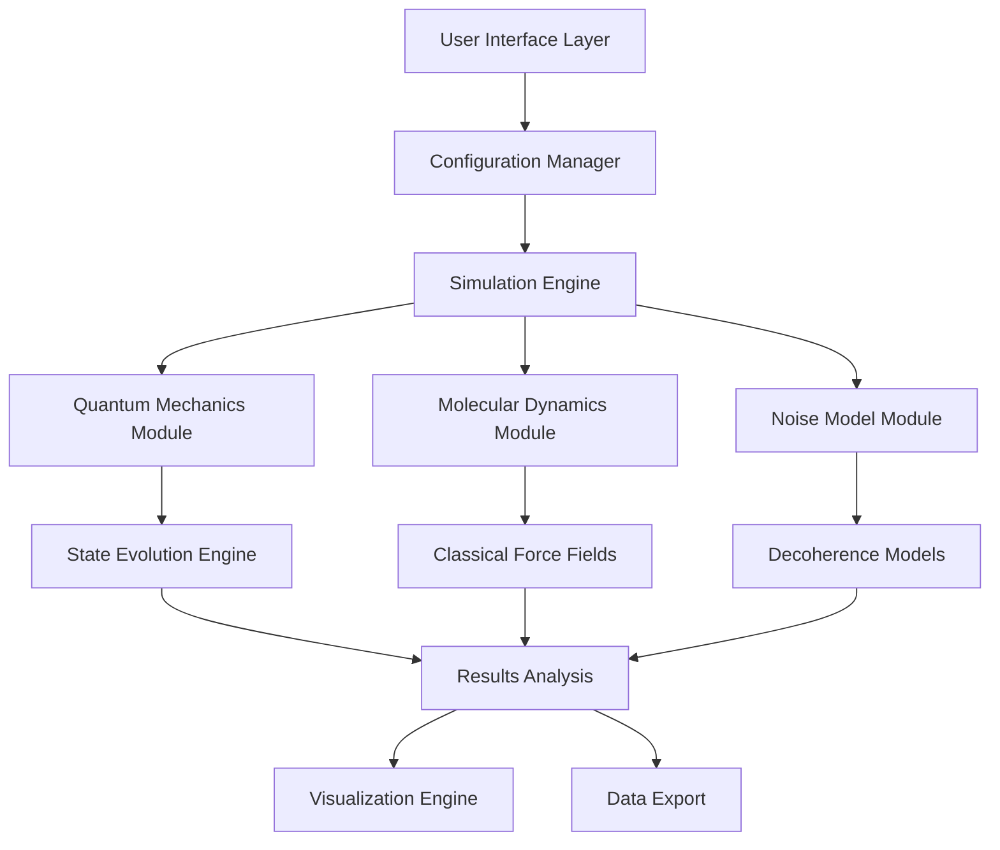

# Design Document - Quantum Biological Environment Simulator (QBES)

## Overview

The Quantum Biological Environment Simulator (QBES) is designed as a modular, scientifically-rigorous toolkit for simulating quantum mechanical effects in biological environments. The system employs established theoretical frameworks from open quantum systems theory, specifically the Lindblad master equation formalism and stochastic Schrödinger equations, to model quantum decoherence in noisy biological environments.

The core innovation lies in the integration of molecular dynamics (MD) simulations with quantum mechanical calculations, creating a hybrid QM/MM approach that captures both the quantum coherence effects and the classical thermal fluctuations that drive decoherence in biological systems.

## Architecture

The system follows a layered architecture with clear separation of concerns:



### Core Components:

1. **Configuration Manager**: Handles input parsing, parameter validation, and system setup
2. **Simulation Engine**: Orchestrates the quantum-classical hybrid simulation
3. **Quantum Mechanics Module**: Implements quantum state evolution using established open quantum system methods
4. **Molecular Dynamics Module**: Handles classical molecular simulation for environmental noise generation
5. **Noise Model Module**: Implements scientifically-validated biological noise models
6. **Results Analysis**: Provides statistical analysis and physical validation of results
7. **Visualization Engine**: Generates publication-ready plots and animations

## Components and Interfaces

### 1. Configuration Manager (`config_manager.py`)

**Responsibilities:**
- Parse YAML configuration files
- Validate input parameters against physical constraints
- Load and process PDB files
- Initialize system parameters

**Key Methods:**
```python
class ConfigurationManager:
    def load_config(self, config_path: str) -> SimulationConfig
    def validate_parameters(self, config: SimulationConfig) -> ValidationResult
    def parse_pdb(self, pdb_path: str) -> MolecularSystem
    def identify_quantum_subsystem(self, system: MolecularSystem) -> QuantumSubsystem
```

### 2. Quantum Mechanics Module (`quantum_engine.py`)

**Theoretical Foundation:**
Based on the Lindblad master equation for open quantum systems:
```
dρ/dt = -i[H, ρ] + Σᵢ(LᵢρLᵢ† - ½{Lᵢ†Lᵢ, ρ})
```

Where:
- H is the system Hamiltonian
- Lᵢ are Lindblad operators representing environmental coupling
- ρ is the density matrix

**Key Methods:**
```python
class QuantumEngine:
    def initialize_hamiltonian(self, system: QuantumSubsystem) -> Hamiltonian
    def evolve_state(self, initial_state: DensityMatrix, time_step: float) -> DensityMatrix
    def calculate_coherence_measures(self, state: DensityMatrix) -> CoherenceMetrics
    def apply_lindblad_operators(self, state: DensityMatrix, operators: List[LindbladOperator]) -> DensityMatrix
```

### 3. Molecular Dynamics Module (`md_engine.py`)

**Responsibilities:**
- Generate classical trajectories for the biological environment
- Calculate time-dependent fluctuations in quantum system parameters
- Interface with established MD packages (OpenMM, GROMACS)

**Key Methods:**
```python
class MDEngine:
    def initialize_system(self, pdb_file: str, force_field: str) -> MDSystem
    def run_trajectory(self, duration: float, time_step: float) -> Trajectory
    def extract_quantum_parameters(self, trajectory: Trajectory) -> ParameterTimeSeries
    def calculate_spectral_density(self, fluctuations: TimeSeries) -> SpectralDensity
```

### 4. Noise Model Module (`noise_models.py`)

**Scientific Basis:**
Implements validated biological noise models including:
- Ohmic spectral densities for protein environments
- 1/f noise from conformational fluctuations
- Vibrational coupling to specific phonon modes

**Key Methods:**
```python
class NoiseModelFactory:
    def create_protein_noise_model(self, temperature: float, coupling_strength: float) -> NoiseModel
    def create_membrane_noise_model(self, lipid_composition: Dict) -> NoiseModel
    def create_solvent_noise_model(self, solvent_type: str, ionic_strength: float) -> NoiseModel

class NoiseModel:
    def generate_lindblad_operators(self, system: QuantumSubsystem) -> List[LindbladOperator]
    def calculate_decoherence_rates(self, temperature: float) -> Dict[str, float]
```

### 5. Results Analysis Module (`analysis.py`)

**Responsibilities:**
- Calculate quantum coherence measures (quantum discord, entanglement measures)
- Perform statistical analysis of decoherence times
- Validate results against physical expectations
- Generate uncertainty estimates

**Key Methods:**
```python
class ResultsAnalyzer:
    def calculate_coherence_lifetime(self, state_trajectory: List[DensityMatrix]) -> float
    def measure_quantum_discord(self, bipartite_state: DensityMatrix) -> float
    def validate_energy_conservation(self, trajectory: StateTrajectory) -> ValidationResult
    def generate_statistical_summary(self, results: SimulationResults) -> StatisticalSummary
```

## Data Models

### Core Data Structures:

```python
@dataclass
class SimulationConfig:
    system_pdb: str
    temperature: float
    simulation_time: float
    time_step: float
    quantum_subsystem_selection: str
    noise_model_type: str
    output_directory: str

@dataclass
class QuantumSubsystem:
    atoms: List[Atom]
    hamiltonian_parameters: Dict[str, float]
    coupling_matrix: np.ndarray
    basis_states: List[QuantumState]

@dataclass
class SimulationResults:
    state_trajectory: List[DensityMatrix]
    coherence_measures: Dict[str, List[float]]
    energy_trajectory: List[float]
    decoherence_rates: Dict[str, float]
    statistical_summary: StatisticalSummary
```

## Error Handling

### Validation Strategy:
1. **Input Validation**: Check parameter ranges against physical constraints
2. **Numerical Stability**: Monitor for unphysical results (negative probabilities, norm violations)
3. **Convergence Checking**: Ensure simulation convergence through multiple metrics
4. **Resource Monitoring**: Track memory usage and computational time

### Error Recovery:
```python
class ErrorHandler:
    def handle_convergence_failure(self, simulation: Simulation) -> RecoveryAction
    def handle_resource_exhaustion(self, system_size: int) -> SystemReduction
    def handle_unphysical_results(self, results: SimulationResults) -> DiagnosticReport
```

## Testing Strategy

### 1. Unit Testing
- Test each module independently with known inputs/outputs
- Validate quantum mechanical calculations against analytical solutions
- Test noise model implementations against literature benchmarks

### 2. Integration Testing
- Test full simulation pipeline with simple model systems
- Validate QM/MM coupling mechanisms
- Test error handling and recovery procedures

### 3. Scientific Validation
- Compare results against published experimental data where available
- Implement benchmark systems with known quantum coherence properties
- Cross-validate against other quantum simulation packages

### 4. Performance Testing
- Benchmark computational scaling with system size
- Memory usage profiling for large molecular systems
- Optimization of critical computational bottlenecks

## Implementation Notes

### Scientific Rigor Requirements:
1. All quantum mechanical methods must be based on peer-reviewed theoretical frameworks
2. Noise models must be validated against experimental measurements where possible
3. Results must include uncertainty quantification and physical validation checks
4. Documentation must include complete mathematical formulations and literature citations

### Computational Considerations:
1. Use established scientific computing libraries (NumPy, SciPy, QuTiP for quantum operations)
2. Implement efficient sparse matrix operations for large quantum systems
3. Provide options for GPU acceleration where applicable
4. Include automatic system size reduction for computationally intractable problems

### User Experience Design:
1. Provide sensible defaults for all parameters based on typical biological systems
2. Include extensive input validation with helpful error messages
3. Generate progress indicators for long-running simulations
4. Provide multiple output formats (HDF5 for data, PNG/PDF for plots)